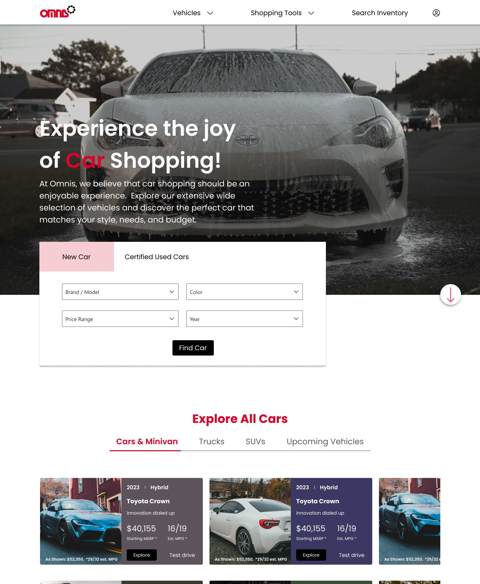

# Omnis-car-web

Omnis car is a web-based project developed usimg HTML, CSS and JavaScript. It is a fully responsive car dealership website designed to allow users browse and search for cars, view car details, and get in touch with dealership. This README file provides an overview of the project.

## Table of contents

